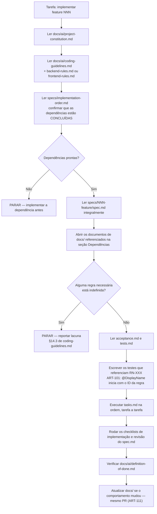
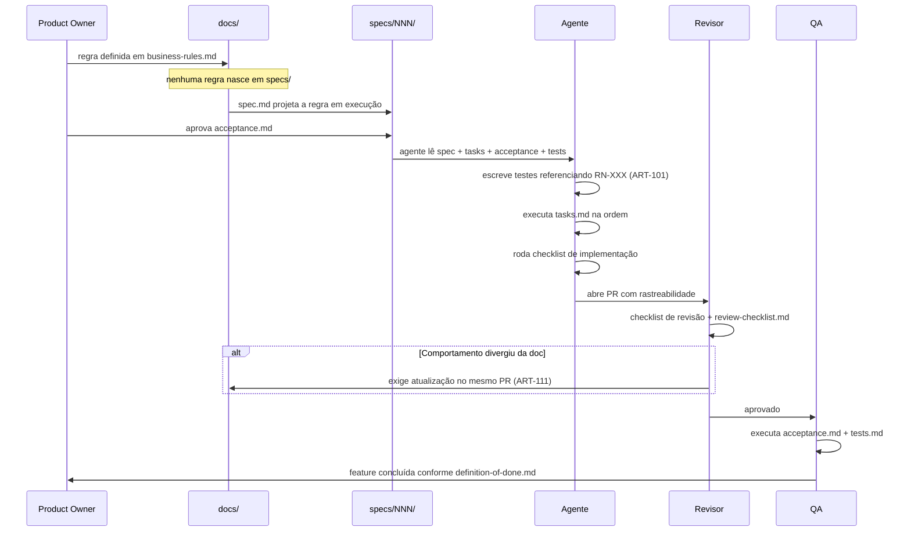

# specs/ — Especificações Executáveis do DevTime

## 1. O que é esta pasta

A pasta `specs/` contém **especificações executáveis por funcionalidade**. Cada subpasta numerada representa **uma funcionalidade completa e implementável do sistema**, descrita com detalhe suficiente para que um agente de IA a implemente de ponta a ponta — backend, banco, frontend e testes — **sem precisar perguntar nenhuma regra de negócio nem nenhuma decisão de arquitetura**.

`specs/` **não duplica** `docs/`. A relação é de **projeção**, não de cópia:

| `docs/` | `specs/` |
|---|---|
| Organizado por **dimensão** (domínio, arquitetura, API, UI, testes) | Organizado por **funcionalidade** |
| Responde "qual é a regra?" e "por que ela existe?" | Responde "o que exatamente eu implemento, em que ordem, e como sei que terminei?" |
| Fonte de verdade normativa | Recorte executável da fonte de verdade |
| Alterado quando o **produto** muda | Alterado quando o **plano de execução** muda |
| Contém enunciados `RN-XXX`, `ART-XXX`, `INV-XXX` | **Referencia** esses identificadores; nunca os reescreve |

**Regra fundamental (SP-01):** nenhuma especificação em `specs/` pode enunciar uma regra de negócio que não exista em `docs/02-domain/business-rules.md`. Se um agente identificar uma lacuna ao ler uma spec, ele **para** e reporta a lacuna no formato da §14.3 de `docs/ai/coding-guidelines.md`. Especular é proibido (IA-01).

---

## 2. Objetivo

| # | Objetivo |
|---|---|
| OB-01 | Permitir que uma funcionalidade seja implementada por um único agente, em uma única sessão, com contexto fechado |
| OB-02 | Tornar explícito **todo** artefato de código a ser criado (Controller, Service, Repository, DTO, Mapper, Validator, Exception, componente Angular, rota, guard) |
| OB-03 | Eliminar decisão implícita: toda validação, todo caso de erro, todo caso extremo está escrito |
| OB-04 | Fornecer critérios de aceite verificáveis em Gherkin e um plano de testes completo antes da primeira linha de código |
| OB-05 | Definir a ordem oficial de implementação, com dependências explícitas |
| OB-06 | Garantir rastreabilidade bidirecional: `specs/` → `docs/` → código → teste |

---

## 3. Estrutura

```
specs/
├── README.md                  # este arquivo
├── implementation-order.md    # ordem oficial, dependências, sprints, estimativas
├── feature-template.md        # template obrigatório de toda feature
├── 001-authentication/
│   ├── spec.md                # a especificação completa da funcionalidade
│   ├── tasks.md               # decomposição em tarefas atômicas rastreáveis
│   ├── acceptance.md          # critérios de aceite em Gherkin
│   └── tests.md               # plano de testes por tipo
├── 002-users/
├── 003-clients/
├── 004-contracts/
├── 005-categories/
├── 006-tags/
├── 007-tickets/
├── 008-worklogs/
├── 009-timer/
├── 010-dashboard/
├── 011-bank-hours/
├── 012-reports/
├── 013-notifications/
├── 014-comments/
├── 015-attachments/
└── future/                    # fora do MVP — apenas intenção e fronteira
    ├── README.md              # regras da pasta (FU-01 a FU-06) e índice
    ├── 016-teams/spec.md
    ├── 017-permissions/spec.md
    ├── 018-subscriptions/spec.md
    ├── 019-public-api/spec.md
    └── 020-ai/spec.md
```

> **`future/` possui apenas `spec.md` por feature**, e essa spec **não** segue o `feature-template.md`. Ela registra a *fronteira*: objetivo, motivo do adiamento, o que o MVP já preserva e — a única parte vinculante hoje — o que não pode ser quebrado. Preencher 39 seções para uma feature que só será construída em fases posteriores produziria documentação que envelhece antes de ser lida. As regras dessa pasta estão em [`future/README.md`](future/README.md).

### 3.1 Papel de cada arquivo

| Arquivo | Pergunta que responde | Consumidor principal |
|---|---|---|
| `spec.md` | **O quê** e **por quê**. Regras, fluxos, estados, erros, artefatos de código a criar | Agente implementador |
| `tasks.md` | **Em que ordem**. Tarefas atômicas com ID, dependência, estimativa e prioridade | Agente implementador · planejamento de sprint |
| `acceptance.md` | **Quando está pronto**. Cenários Gherkin: feliz, erro, extremo, segurança, concorrência | QA · agente de testes · Product Owner |
| `tests.md` | **Como provar**. Plano de testes por tipo, com objetivo, pré-condição, passos e resultado | Agente de testes · revisor |

### 3.2 Numeração

| Faixa | Significado |
|---|---|
| `001`–`015` | Funcionalidades do MVP (fases F0–F4). Escopo fechado (§5 de `docs/07-backlog/mvp.md`) |
| `016`–`020` | Funcionalidades pós-MVP em `future/`. Especificadas apenas na fronteira: objetivo, motivo do adiamento e o que **não** pode ser quebrado hoje |

> **Atenção:** o número da pasta é um **identificador estável**, não a ordem de implementação. A ordem oficial está em [`implementation-order.md`](implementation-order.md) e **difere** da numeração (exemplo: `011-bank-hours` precede `010-dashboard`). Isso é intencional: renumerar pastas quebraria referências cruzadas e histórico.

---

## 4. Como utilizar

### 4.1 Fluxo obrigatório do agente implementador



### 4.2 Ordem de leitura mínima para implementar uma feature

Um agente deve conseguir implementar qualquer funcionalidade lendo **exclusivamente**:

| # | Documento | Papel |
|---|---|---|
| 1 | `docs/ai/project-constitution.md` | Proibições invioláveis (ART-XXX) |
| 2 | `docs/ai/coding-guidelines.md` | Convenções transversais, nomenclatura, commits |
| 3 | `docs/03-architecture/architecture.md` | Decisões estruturais (ADR-001 a ADR-007) |
| 4 | `docs/03-architecture/backend.md` | Camadas, padrões, tenancy, transações, eventos |
| 5 | `docs/03-architecture/frontend.md` | Signals, stores, interceptors, rotas |
| 6 | `specs/NNN-feature/spec.md` + `tasks.md` + `acceptance.md` + `tests.md` | O recorte executável |

Documentos adicionais (`entities.md`, `business-rules.md`, `permissions.md`, `state-machines.md`, `04-api/*`, `05-ui/*`) são abertos **sob demanda**, sempre que a spec os referenciar explicitamente na seção **Dependências**.

### 4.3 Como ler uma referência

| Notação na spec | Significa | Onde está |
|---|---|---|
| `RN-102` | Regra de negócio | `docs/02-domain/business-rules.md` |
| `ART-021` | Artigo da constituição | `docs/ai/project-constitution.md` |
| `INV-WKL-05` | Invariante de entidade | `docs/02-domain/entities.md` |
| `DEVTIME-2102` | Código de erro | `docs/02-domain/business-rules.md` §17 |
| `CE-12`, `CE-ME-04` | Caso especial | `business-rules.md` §16 · `state-machines.md` §6 |
| `US-081` | User story | `docs/07-backlog/stories.md` |
| `TC-0400` | Caso de teste | `docs/06-testing/test-cases.md` |
| `P23` | Tela | `docs/05-ui/pages.md` |
| `AQ-01` | Atributo de qualidade | `docs/03-architecture/architecture.md` §9 |

---

## 5. Responsabilidades

| Papel | Responsabilidade | O que **não** pode fazer |
|---|---|---|
| **Product Owner** | Manter `docs/01-product/` e `docs/02-domain/`. Aprovar `acceptance.md` | Escrever regra diretamente em `specs/` |
| **Arquiteto** | Manter `docs/03-architecture/` e revisar as seções de artefatos de código das specs | Aprovar spec que contrarie uma ADR |
| **Autor da spec** | Projetar `docs/` em uma feature executável, sem inventar nada | Criar regra, código de erro ou permissão nova |
| **Agente implementador** | Executar `tasks.md` na ordem; escrever teste antes do código | Prosseguir com lacuna; desabilitar teste; inventar regra |
| **Revisor** | Aplicar `docs/ai/review-checklist.md` e o checklist de revisão da spec | Aprovar PR sem rastreabilidade a `RN-XXX` |
| **QA** | Executar `acceptance.md` e `tests.md` | Declarar feito com cenário de segurança ou concorrência pendente |

---

## 6. Fluxo de desenvolvimento de uma feature



### 6.1 Estados de uma feature

| Estado | Significado | Critério de saída |
|---|---|---|
| `SPEC_DRAFT` | Spec sendo escrita | Todas as seções do template preenchidas; zero lacuna |
| `SPEC_APPROVED` | Aprovada por PO e Arquiteto | `acceptance.md` assinado pelo PO |
| `READY` | Dependências concluídas | `implementation-order.md` confirma predecessoras em `DONE` |
| `IN_PROGRESS` | Tarefas em execução | — |
| `IN_REVIEW` | PR aberto | Checklists de implementação e revisão verdes |
| `DONE` | Concluída | `definition-of-done.md` §7 integralmente atendido |

**Regra:** uma feature nunca entra em `IN_PROGRESS` com uma dependência fora de `DONE`. A tentação de "adiantar o frontend" cria integração retrabalhada e testes falsos.

---

## 7. Relação com `docs/` — mapa de projeção

| Documento de `docs/` | É projetado em | Como |
|---|---|---|
| `02-domain/entities.md` | Seção **Modelo de dados** de cada spec | Campos obrigatórios, invariantes e imutabilidade da feature |
| `02-domain/business-rules.md` | Seção **Regras de negócio** | Tabela das `RN-XXX` aplicáveis, com tipo e código de erro |
| `02-domain/state-machines.md` | Seções **Estados** e **Transições** | Matriz e diagrama restritos à feature |
| `02-domain/permissions.md` | Seção **Permissões** | Permissões exigidas por operação e regras de ownership |
| `03-architecture/backend.md` | Seções **Serviços Backend**, **DTOs**, **Mappers**, **Repositories** | Lista nominal das classes a criar |
| `03-architecture/frontend.md` | Seção **Componentes Frontend** | Componentes, stores, rotas, guards e interceptors |
| `03-architecture/database.md` | Seção **Modelo de dados** | Tabelas, índices e migrations impactadas |
| `03-architecture/security.md` | Seção **Segurança** | Superfície de ataque específica da feature |
| `04-api/*.md` | Seção **Endpoints utilizados** | Contrato exato, sem redefinir payloads |
| `05-ui/pages.md` e `components.md` | Seção **Componentes Frontend** | Telas `PXX` e componentes `dt-*` envolvidos |
| `06-testing/*.md` | `tests.md` e `acceptance.md` | Casos `TC-XXXX` referenciados e expandidos |
| `07-backlog/stories.md` | `tasks.md` | Rastreabilidade `US-XXX` → tarefas |
| `ai/definition-of-done.md` | Seção **Definition of Done** | Recorte aplicável à feature |

### 7.1 Hierarquia em caso de conflito (IA-11)

```
project-constitution.md  >  02-domain/  >  03-architecture/  >  04-api/  >  05-ui/  >  specs/
```

Se uma spec contradiz `docs/`, **a spec está errada**. Corrija a spec e reporte. Nunca implemente a spec divergente.

---

## 8. Padrões obrigatórios de toda spec

| # | Padrão |
|---|---|
| SP-01 | Nenhuma regra de negócio nova. Somente referência a `RN-XXX` existente |
| SP-02 | Nenhum código-fonte. Assinaturas e nomes de classe são permitidos; corpo de método não |
| SP-03 | Todo documento em Markdown, com tabelas para qualquer enumeração |
| SP-04 | Ao menos um diagrama Mermaid por `spec.md` (fluxo, estado ou sequência) |
| SP-05 | Nenhuma regra implícita. Se o comportamento não está escrito, ele não existe |
| SP-06 | Toda exceção e todo caso extremo documentados, inclusive os que "nunca acontecem" |
| SP-07 | Toda decisão acompanhada da motivação e da alternativa rejeitada |
| SP-08 | Toda operação declara: multi-tenant, soft delete, UUID, auditoria, LGPD, performance, segurança |
| SP-09 | Toda spec lista nominalmente os artefatos de código a criar |
| SP-10 | Toda spec informa o que é **proibido** fazer, não apenas o que é esperado |

### 8.1 Considerações transversais obrigatórias

Toda funcionalidade **sempre** responde a estas oito dimensões, ainda que a resposta seja "não se aplica, porque…":

| Dimensão | Pergunta obrigatória | Referência |
|---|---|---|
| **Multi-tenant** | Toda consulta é filtrada por `tenant_id`? Há uso de `@CrossTenant`? Está justificado? | ART-021/022/023 |
| **Soft delete** | A exclusão é lógica? Registros excluídos somem de toda consulta padrão? | RN-003, ART-051 |
| **UUID** | PK é UUIDv7 gerado na aplicação? IDs são seguros para exposição em URL? | ADR-005, ART-010 |
| **Auditoria** | Quais ações geram `AuditLog`, com quais `beforeState`/`afterState`? | RN-006, INV-AUD-01 |
| **LGPD** | Há dado pessoal? Como é exportado, anonimizado e purgado? O que **não** entra em log? | ART-084, RN-008 |
| **Escalabilidade** | Como a feature se comporta com 100k+ registros por tenant? | §10.2 de `architecture.md` |
| **Performance** | Qual a meta de p95? Quais índices sustentam as consultas? Há risco de N+1? | AQ-01, DA-05 |
| **Segurança** | Qual a superfície de ataque? Acesso cross-tenant retorna `404`? | ART-024, AQ-03 |

---

## 9. Convenções de identificadores em `specs/`

| Prefixo | Significado | Escopo |
|---|---|---|
| `T-NNN-XX` | Tarefa (`tasks.md`), onde `NNN` é o número da feature | Único por feature |
| `AC-NNN-XX` | Cenário de aceite (`acceptance.md`) | Único por feature |
| `TS-NNN-XX` | Caso de teste (`tests.md`) | Único por feature |
| `SP-XX` | Padrão desta pasta | Global |
| `OB-XX` | Objetivo desta pasta | Global |

**Regra:** identificadores são **estáveis e imutáveis**. Um cenário removido tem seu ID aposentado, nunca reutilizado — reutilização quebra o histórico de rastreabilidade em commits e PRs antigos.

---

## 10. O que esta pasta **não** contém

| Não contém | Onde está |
|---|---|
| Código-fonte, mesmo de exemplo executável | `backend/`, `frontend/` |
| Enunciado original de regra de negócio | `docs/02-domain/business-rules.md` |
| Contrato completo de payload HTTP | `docs/04-api/*.md` |
| Design visual, tokens, cores | `docs/05-ui/design-system.md` |
| Decisão arquitetural (ADR) | `docs/03-architecture/architecture.md` |
| Estimativa comercial ou preço | Fora do repositório |
| Documentação de operação e runbook | `infra/` |

---

## 11. Manutenção

| # | Regra |
|---|---|
| MN-01 | Alterar uma `RN-XXX` obriga a revisar **todas** as specs que a referenciam, no mesmo PR |
| MN-02 | Criar feature nova exige: nova pasta, entrada em `implementation-order.md` e conformidade total com `feature-template.md` |
| MN-03 | Nenhuma spec é marcada `DONE` com seção do template vazia ou com a marcação `TBD` |
| MN-04 | Feature movida para `future/` preserva o número original |
| MN-05 | A remoção de uma feature exige registro do motivo em `docs/07-backlog/future.md` |
| MN-06 | Divergência entre spec e código detectada em revisão é **bug**, e o PR é bloqueado até a decisão de qual dos dois está errado |

---

## 12. Critérios de aceite desta pasta

| # | Critério |
|---|---|
| CA-01 | Toda feature possui exatamente os quatro arquivos e todas as seções do template |
| CA-02 | Nenhuma spec enuncia regra de negócio inexistente em `docs/` |
| CA-03 | Toda `RN-XXX` do MVP é referenciada por ao menos uma spec |
| CA-04 | Toda permissão de `permissions.md` §7 aparece na seção **Permissões** de alguma spec |
| CA-05 | Todo endpoint de `04-api/` aparece na seção **Endpoints utilizados** de alguma spec |
| CA-06 | Toda spec contém ao menos um diagrama Mermaid |
| CA-07 | `implementation-order.md` não possui ciclo de dependência |
| CA-08 | Todo cenário de `acceptance.md` está em Gherkin válido e é verificável |
| CA-09 | Toda feature cobre as oito dimensões transversais da §8.1 |
| CA-10 | Nenhum identificador `T-`, `AC-` ou `TS-` está duplicado dentro de uma feature |
