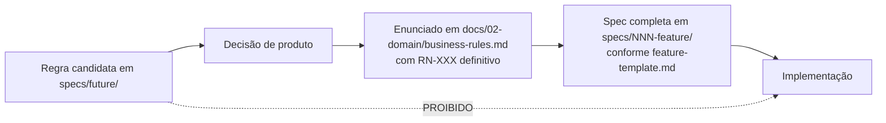

# specs/future/ — Funcionalidades Pós-MVP

## 1. O que esta pasta é

Especificações de **fronteira** das funcionalidades `016` a `020`, que estão fora do MVP (fases F5 a F8 de `docs/00-overview/roadmap.md`).

Elas **não** seguem o `feature-template.md` completo. Um template de 39 seções preenchido para uma feature que só será construída em 12 meses produz documentação que envelhece antes de ser lida: as regras mudam, o produto aprende com o beta, e o esforço de manutenção supera o valor.

O que estas specs registram é o que **precisa existir agora** para que a funcionalidade seja viável depois.

## 2. Estrutura de cada spec de fronteira

| Seção | Pergunta que responde |
|---|---|
| **1. Objetivo** | O que a funcionalidade entrega, em uma frase |
| **2. Por que está fora do MVP** | O motivo do adiamento, não a ausência de tempo |
| **3. Fronteira preservada hoje** | O que o MVP **já** contempla para não bloquear esta feature |
| **4. O que não pode ser quebrado** | Decisões atuais que, se revertidas, tornariam esta feature cara ou impossível |
| **5. Dependências** | Features de `specs/` e de `future/` que precisam existir antes |
| **6. Regras preliminares** | Enunciados **candidatos**, ainda não normativos |
| **7. Impacto nas features existentes** | O que muda em `001`–`015` quando esta entrar |
| **8. Riscos de antecipação** | O que dá errado se ela for construída antes do tempo |
| **9. Gatilho de priorização** | O sinal objetivo que indica que chegou a hora |

## 3. Regra fundamental (FU-01)

> **Nenhum enunciado nesta pasta é normativo.**

As regras da §6 de cada spec são **candidatas**. Elas não existem em `docs/02-domain/business-rules.md` e, portanto, **não podem ser implementadas** (SP-01, IA-01). Antes de qualquer código:

Um agente que encontrar uma regra candidata e implementá-la está inventando regra de negócio — a violação mais grave de `project-constitution.md` (IA-01).

## 4. Regras desta pasta

| # | Regra |
|---|---|
| FU-01 | Nenhum enunciado é normativo. Regras candidatas não são implementáveis |
| FU-02 | O número da pasta é preservado ao promover a feature para `specs/` (MN-04) |
| FU-03 | Promover exige: regra em `business-rules.md`, spec completa conforme o template e entrada em `implementation-order.md` |
| FU-04 | A §4 (o que não pode ser quebrado) é **vinculante para o MVP** — é a única parte com efeito prático hoje |
| FU-05 | Alterar uma decisão listada na §4 de qualquer spec exige registrar o impacto sobre a feature futura |
| FU-06 | Remover uma feature desta pasta exige registro do motivo em `docs/07-backlog/future.md` §12 |

## 5. Índice

| Nº | Nome | Fase | Épico | Depende de | Motivo do adiamento |
|:--:|---|:--:|---|---|---|
| [016](016-teams/spec.md) | Teams | F5 | EP-16 | `002` | A persona primária opera sozinha |
| [017](017-permissions/spec.md) | Permissions | F5 | EP-16 · EP-17 | `016` | RBAC fixo cobre o MVP |
| [018](018-subscriptions/spec.md) | Subscriptions | F6 | EP-18 | `016` | Validar valor antes de monetizar |
| [019](019-public-api/spec.md) | Public API | F8 | EP-21 | `017` | Sem demanda validada |
| [020](020-ai/spec.md) | AI | F7 | EP-20 | `008`, `011`, `012` | Exige base histórica de dados |

> **`019` está em F8 e `020` em F7.** A numeração da pasta segue a ordem de leitura conceitual, não a de execução — a mesma convenção de `specs/` (§3.2 do `README.md` principal). `020-ai` provavelmente será construída **antes** de `019-public-api`.

## 6. Como usar

| Se você é… | Faça |
|---|---|
| **Agente implementando uma feature do MVP** | Leia a §4 da spec de fronteira relevante **antes** de alterar decisões estruturais. É a única parte vinculante hoje |
| **Arquiteto revisando um PR** | Verifique se a mudança quebra alguma decisão listada em §4 de alguma spec de `future/` |
| **Product Owner priorizando** | Consulte a §9 (gatilho de priorização) e a §8 (riscos de antecipação) |
| **Agente promovendo uma feature** | Siga FU-03: regra em `docs/` primeiro, spec completa depois, `implementation-order.md` por último |

## 7. Relação com `docs/07-backlog/future.md`

| Documento | Papel |
|---|---|
| `docs/07-backlog/future.md` | Autoridade sobre **escopo e motivação** de produto das fases F5–F8 |
| `specs/future/*/spec.md` | Projeção **técnica** da fronteira: o que preservar hoje e o que muda depois |

Em caso de divergência de escopo, `docs/07-backlog/future.md` prevalece. Estas specs nunca introduzem escopo que não esteja lá.
