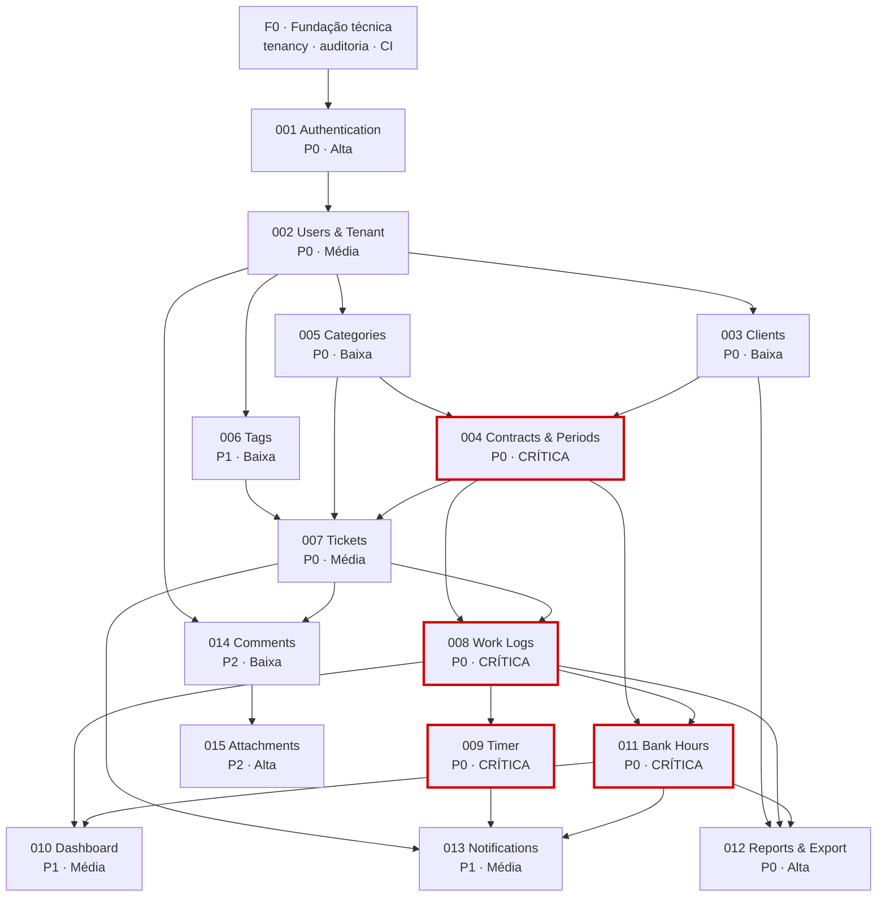
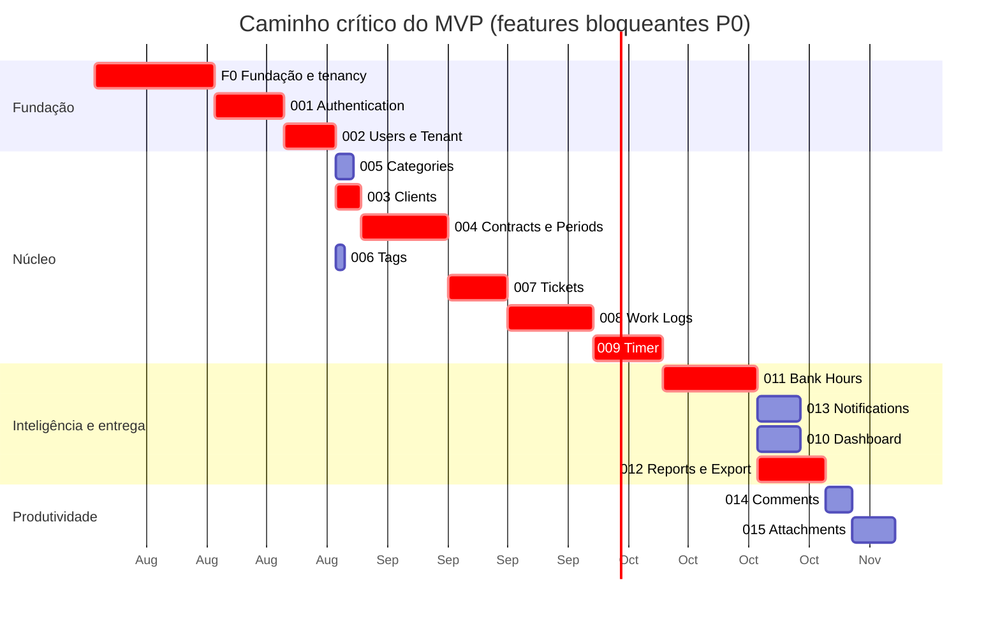

# Ordem Oficial de Implementação — DevTime

## 1. Objetivo

Definir a **ordem canônica** de implementação das funcionalidades do DevTime, com dependências explícitas, prioridade, alocação em sprint, complexidade e estimativa. Nenhuma funcionalidade pode iniciar com uma dependência fora de `DONE`.

Este documento é a autoridade sobre **sequência**. `docs/07-backlog/mvp.md` é a autoridade sobre **escopo** e `docs/07-backlog/epics.md` sobre **agrupamento de valor**. Em caso de divergência de sequência, este documento prevalece; em caso de divergência de escopo, `mvp.md` prevalece.

---

## 2. Como ler as colunas

| Coluna | Significado |
|---|---|
| **Nº** | Identificador estável da pasta em `specs/`. **Não** é a ordem de execução |
| **Ordem** | Posição oficial na fila de implementação. Esta é a sequência a seguir |
| **Nome** | Funcionalidade |
| **Dependências** | Features que precisam estar `DONE` antes do início. `F0` = fundação técnica (sprint S1) |
| **Prioridade** | `P0` bloqueante do MVP · `P1` importante · `P2` cortável (§11.1 de `mvp.md`) |
| **Sprint** | Sprint de `docs/07-backlog/mvp.md` §6 |
| **Complexidade** | `Baixa` · `Média` · `Alta` · `Crítica` — risco técnico, não volume |
| **Estimativa** | Pontos de story agregados + dias-agente sequenciais estimados |

**Sobre complexidade `Crítica`:** significa que um erro na funcionalidade **destrói a confiança no produto** ou **causa falha de segurança**, não que seja difícil. Features críticas exigem duas aprovações em PR (PR-04) e testes escritos antes do código.

---

## 3. Pré-requisito: F0 — Fundação técnica (Sprint S1)

Não é uma feature de `specs/`, mas **bloqueia todas elas**. Corresponde a EP-01 e EP-03.

| Entregável | Referência | Critério de saída |
|---|---|---|
| Projeto Spring Boot 3 / Java 21 com estrutura de pacotes | `backend.md` §5 | ArchUnit verifica AR-01 a AR-09 |
| `BaseEntity`, `AuditListener`, UUIDv7, soft delete | `backend.md` §7.3 | Toda entidade herda e é auditada |
| `TenantContext`, `TenantContextFilter`, `TenantAwareInterceptor` | `backend.md` §7 | Teste prova isolamento entre dois tenants |
| Flyway com migration inicial | `database.md` | Migration do zero em banco limpo |
| `GlobalExceptionHandler` + `ErrorCode` + Problem Details | `backend.md` §12 | Toda exceção vira RFC 7807 |
| Projeto Angular standalone + Signals + PrimeNG + interceptors | `frontend.md` §5, §7.2 | Nenhum `NgModule`; `OnPush` em todos |
| Pipeline CI com todos os gates | `architecture.md` §11 | Gate falha quando deve falhar |
| Docker Compose com PostgreSQL 16 | `coding-guidelines.md` RE-03 | Ambiente sobe em até 3 comandos |

> **Regra F0-01:** nenhuma feature de `specs/` inicia antes de o teste de isolamento entre tenants estar verde. Isolamento retroativo é a classe de retrabalho mais cara do projeto (RP-05).

---

## 4. Ordem oficial

| Ordem | Nº | Nome | Dependências | Prioridade | Sprint | Complexidade | Estimativa |
|:--:|:--:|---|---|:--:|:--:|---|---|
| 1 | 001 | Authentication | F0 | P0 | S2 | Alta | 34 pts · 8 dias |
| 2 | 002 | Users & Tenant | 001 | P0 | S2 · S11 (auditoria) | Média | 26 pts · 6 dias |
| 3 | 005 | Categories | 002 | P0 | S3 | Baixa | 8 pts · 2 dias |
| 4 | 003 | Clients | 002 | P0 | S3 | Baixa | 13 pts · 3 dias |
| 5 | 004 | Contracts & Periods | 003, 005 | P0 | S3 · S4 | **Crítica** | 42 pts · 10 dias |
| 6 | 006 | Tags | 002 | P1 | S4 | Baixa | 5 pts · 1 dia |
| 7 | 007 | Tickets | 004, 005, 006 | P0 | S4 | Média | 29 pts · 7 dias |
| 8 | 008 | Work Logs | 007, 004, 005 | P0 | S5 | **Crítica** | 40 pts · 10 dias |
| 9 | 009 | Timer | 008 | P0 | S6 | **Crítica** | 34 pts · 8 dias |
| 10 | 011 | Bank Hours | 008, 004 | P0 | S7 · S10 | **Crítica** | 45 pts · 11 dias |
| 11 | 013 | Notifications | 011, 009, 007 | P1 | S8 | Média | 21 pts · 5 dias |
| 12 | 010 | Dashboard | 011, 008, 004 | P1 | S8 | Média | 21 pts · 5 dias |
| 13 | 012 | Reports & Export | 011, 008, 003 | P0 | S9 | Alta | 34 pts · 8 dias |
| 14 | 014 | Comments | 007, 002 | P2 | S11 | Baixa | 13 pts · 3 dias |
| 15 | 015 | Attachments | 014, 007 | P2 | S11 | Alta | 21 pts · 5 dias |

**Total MVP:** 386 pontos · ~92 dias-agente sequenciais.

> **Divergência intencional entre `Nº` e `Ordem`:** `011-bank-hours` (ordem 10) precede `010-dashboard` (ordem 12) porque o dashboard **consome** o cálculo de saldo. Construir o dashboard antes exigiria dados falsos e testes que não provam nada. A numeração de pasta permanece pela ordem de leitura conceitual; a fila de execução respeita as dependências reais.

---

## 5. Grafo de dependências

**Verificação de aciclicidade:** o grafo é um DAG. A ordenação topológica da §4 é uma linearização válida. Nenhuma feature depende de outra de ordem superior.

---

## 6. Justificativa da ordem

| Decisão | Motivo | Alternativa rejeitada |
|---|---|---|
| `001` antes de tudo | Sem sessão autenticada não existe `TenantContext`; sem `TenantContext` nenhuma consulta é segura (ART-021) | Implementar CRUDs com tenant fixo e "plugar" auth depois — produz testes que não provam isolamento |
| `005 Categories` antes de `003 Clients` | Categoria é dependência de `WorkLog` (RN-104) e o seed de 9 categorias (RN-501) ocorre na criação do tenant, dentro de `002` | Deixar categorias para o fim — obrigaria a stub em `008` |
| `004` antes de `007` | Ticket exige contrato (RN-301) e sua `key` deriva de `contract.code` (RN-302) | — |
| `007` antes de `008` | Todo work log exige ticket (RN-101). Não existe registro avulso | Permitir work log sem ticket "temporariamente" — viola a regra mais estruturante do produto |
| `008` antes de `009` | O timer é apenas uma forma de capturar um work log; ele **reusa** integralmente as validações RN-102 a RN-120 (RN-159) | Implementar o timer com validações próprias — cria dois caminhos divergentes de regra |
| `011` antes de `010`, `012` e `013` | Saldo é a fonte dos números do dashboard, dos relatórios e dos limiares de alerta (RN-602) | Calcular saldo no dashboard — duplica a fórmula canônica |
| `013` depois de `011` | Alertas de consumo dependem de `consumedMinutes` e dos limiares por período (RN-603) | — |
| `012` depois de `011` | Relatório de período fechado é servido do snapshot (RN-701), produzido pelo fechamento em `011` | — |
| `015` depois de `014` | Anexo pode pertencer a comentário (INV-ATT-01), e o caminho de comentário é o mais simples para validar o upload | — |
| `014`/`015` por último | São `P2` e encabeçam a ordem de corte (§11.1 de `mvp.md`, itens 10) | — |

---

## 7. Alocação por sprint

| Sprint | Fase | Features | Marco | Objetivo verificável |
|:--:|:--:|---|---|---|
| S1 | F0 | — (fundação) | **M0** parcial | Isolamento entre tenants comprovado por teste |
| S2 | F0 | `001`, `002` (perfil, tenant) | **M0** | Ciclo completo de conta e sessão |
| S3 | F1 | `005`, `003`, `004` (CRUD + prévia) | — | Cliente e contrato criáveis com prévia de períodos |
| S4 | F1 | `004` (períodos), `006`, `007` | — | Períodos contíguos gerados; tickets funcionais |
| S5 | F1 | `008` | — | Registro manual com todas as validações |
| S6 | F1 | `009` | **M1** | Cronômetro resiliente · início do dogfooding |
| S7 | F2 | `011` (saldo, extrato, ajustes) | — | Banco de horas com extrato explicativo |
| S8 | F2 | `010`, `013` | — | Dashboard p95 < 800 ms e alertas de consumo |
| S9 | F3 | `012` | — | PDF e Excel entregáveis ao cliente |
| S10 | F3 | `011` (fechamento e snapshot) | **M2** | Fechamento atômico · início do beta fechado |
| S11 | F4 | `014`, `015`, `002` (auditoria) | — | Contexto do trabalho e rastreabilidade |
| S12 | F4 | Busca, filtros e estabilização | **M3** | Checklist do MVP 100% verde |

> **`011-bank-hours` ocupa duas sprints não contíguas.** S7 entrega cálculo, extrato e ajustes (EP-08). S10 entrega fechamento, snapshot e reabertura (EP-12). A separação é intencional: o fechamento congela relatórios, e relatórios (`012`, S9) precisam existir para que o congelamento seja verificável de ponta a ponta.

---

## 8. Caminho crítico

**Caminho crítico:** `F0 → 001 → 002 → 003 → 004 → 007 → 008 → 009 → 011 → 012`.
Qualquer atraso nessas features atrasa o MVP integralmente. `005`, `006`, `010`, `013`, `014` e `015` possuem folga e podem ser paralelizados por um segundo agente.

### 8.1 Oportunidades de paralelização

| Janela | Agente A (caminho crítico) | Agente B (paralelo) | Condição |
|---|---|---|---|
| S3 | `003 Clients` → `004 Contracts` | `005 Categories`, `006 Tags` | Ambos dependem apenas de `002` |
| S4 | `004` (geração de períodos) | `007 Tickets` (CRUD e quadro) | `007` só integra com `004` ao final |
| S8 | `010 Dashboard` | `013 Notifications` | Ambos consomem `011`, sem se tocarem |
| S11 | `014 Comments` → `015 Attachments` | `002` (auditoria) | Áreas disjuntas |

**Regra de paralelização:** duas features só rodam em paralelo se **não compartilharem migration nem arquivo**. Compartilhamento de migration gera conflito de versão Flyway, cuja resolução é sempre manual e propensa a erro (ART-053: migration é imutável após merge).

---

## 9. Matriz de risco por feature

| Nº | Feature | Risco principal | Prob. | Impacto | Mitigação | Gatilho de acionamento |
|:--:|---|---|:--:|:--:|---|---|
| 001 | Authentication | Corrida de refresh entre abas; cookie bloqueado | Média | Alto | Fila única de refresh no interceptor; teste multi-aba | Falha em `TC-0010`–`TC-0042` |
| 002 | Users & Tenant | Último `OWNER` removido | Baixa | Alto | RN-455 testada em concorrência | Qualquer tenant sem OWNER |
| 003 | Clients | Validação de CPF/CNPJ | Baixa | Baixo | Casos-limite tabelados | — |
| 004 | Contracts & Periods | **Bordas de calendário na geração de períodos (RP-01)** | Alta | Crítico | Suíte temporal escrita **antes** do código | Qualquer falha em `TC-047xT` |
| 005 | Categories | Exclusão com work logs vinculados | Baixa | Médio | RN-505 exige categoria substituta | — |
| 006 | Tags | Normalização inconsistente | Baixa | Baixo | RN-506 com tabela de exemplos | — |
| 007 | Tickets | Sequência de `number` sob concorrência | Média | Médio | Geração atômica no banco | Duas chaves iguais |
| 008 | Work Logs | **Sobreposição não detectada (RN-102)** | Média | Crítico | Índice dedicado; teste de concorrência | Qualquer sobreposição persistida |
| 009 | Timer | **Perda de tempo trabalhado (RP-02)** | Alta | Alto | Estado 100% no servidor; RN-160 preserva o timer | Instabilidade no dogfooding |
| 010 | Dashboard | Desempenho com volume (RP-06) | Média | Médio | Índice coberto; teste de carga desde S8 | p95 > 800 ms |
| 011 | Bank Hours | **Erro de cálculo de saldo (RP-03)** | Média | Crítico | Determinismo testado; reconciliação; snapshot com checksum | Qualquer divergência reportada |
| 012 | Reports | Qualidade visual do PDF (RP-04) | Média | Alto | Spike SP-01 antecipado para S8 | Avaliação externa negativa |
| 013 | Notifications | Alerta duplicado ou ausente | Média | Médio | `dedupeKey` por limiar por período (RN-603) | Dois alertas do mesmo limiar |
| 014 | Comments | Menção a membro inativo | Baixa | Baixo | RN-813 filtra membros ativos | — |
| 015 | Attachments | **Arquivo malicioso liberado** | Baixa | Crítico | Allowlist + magic number + antivírus (RN-802/803) | EICAR liberado para download |

---

## 10. Regras de sequenciamento

| # | Regra |
|---|---|
| SQ-01 | Nenhuma feature inicia com dependência fora de `DONE`. "Quase pronto" não é `DONE` (CE-M-02) |
| SQ-02 | Feature de complexidade `Crítica` exige os testes escritos e revisados **antes** da implementação |
| SQ-03 | Feature de complexidade `Crítica` exige duas aprovações em PR (PR-04) |
| SQ-04 | Duas features em paralelo nunca compartilham migration nem arquivo |
| SQ-05 | Migration de uma feature é criada apenas quando a feature entra em `IN_PROGRESS`, evitando reserva de número |
| SQ-06 | Um endpoint só é exposto quando sua permissão está implementada e testada (CA-02 de `permissions.md`) |
| SQ-07 | Nenhum frontend de feature inicia antes de o backend correspondente estar `DONE` e o contrato OpenAPI publicado |
| SQ-08 | Corte de escopo segue exclusivamente a ordem da §11.1 de `mvp.md`; cortar fora de ordem exige registro de decisão |
| SQ-09 | Toda feature entrega backend, frontend, testes e documentação atualizada — não existe entrega "só backend" |
| SQ-10 | Divergência de saldo reportada em qualquer momento **bloqueia toda a fila** até a causa raiz ser corrigida (§11 de `mvp.md`) |

---

## 11. Features pós-MVP (`future/`)

Não entram na fila. Estão especificadas apenas na **fronteira**: o que precisa ser preservado hoje para que sejam viáveis amanhã.

| Nº | Nome | Fase | Épico | Depende de | Por que está fora do MVP |
|:--:|---|:--:|---|---|---|
| 016 | Teams (equipe e convites) | F5 | EP-16 | 002 | A persona primária opera sozinha |
| 017 | Permissions (granulares por contrato) | F5 | EP-16/EP-17 | 016 | RBAC fixo cobre o MVP |
| 018 | Subscriptions (planos e cobrança) | F6 | EP-18 | 016 | Validar valor antes de monetizar |
| 019 | Public API (chaves, escopos, webhooks) | F8 | — | 017 | Sem demanda validada |
| 020 | AI (sugestões e automações) | F7 | — | 008, 011, 012 | Exige base histórica de dados |

---

## 12. Rastreamento de progresso

| Nº | Feature | Spec | Tasks | Aceite | Testes | Status |
|:--:|---|:--:|:--:|:--:|:--:|---|
| 001 | Authentication | ✅ | ✅ | ✅ | ✅ | `BACKEND_DONE` ⁷ |
| 002 | Users & Tenant | ✅ | ✅ | ✅ | ✅ | `SPEC_APPROVED` |
| 003 | Clients | ✅ | ✅ | ✅ | ✅ | `BACKEND_DONE` ¹ |
| 004 | Contracts & Periods | ✅ | ✅ | ✅ | ✅ | `BACKEND_PARTIAL` ² |
| 005 | Categories | ✅ | ✅ | ✅ | ✅ | `BACKEND_DONE` ³ |
| 006 | Tags | ✅ | ✅ | ✅ | ✅ | `BACKEND_DONE` ⁴ |
| 007 | Tickets | ✅ | ✅ | ✅ | ✅ | `BACKEND_DONE` ⁵ |
| 008 | Work Logs | ✅ | ✅ | ✅ | ✅ | `SPEC_APPROVED` |
| 009 | Timer | ✅ | ✅ | ✅ | ✅ | `SPEC_APPROVED` |
| 010 | Dashboard | ✅ | ✅ | ✅ | ✅ | `SPEC_APPROVED` |
| 011 | Bank Hours | ✅ | ✅ | ✅ | ✅ | `SPEC_APPROVED` |
| 012 | Reports & Export | ✅ | ✅ | ✅ | ✅ | `SPEC_APPROVED` |
| 013 | Notifications | ✅ | ✅ | ✅ | ✅ | `SPEC_APPROVED` |
| 014 | Comments | ✅ | ✅ | ✅ | ✅ | `BACKEND_DONE` ⁶ |
| 015 | Attachments | ✅ | ✅ | ✅ | ✅ | `SPEC_APPROVED` |

> Atualizar a coluna **Status** é obrigatório no PR que conclui a feature (MN-03).

**Notas da sprint S3 (backend):**

| # | Nota |
|:--:|---|
| ¹ | `003` — backend completo (CRUD, contatos, inativação, exclusão restrita, busca, paginação, auditoria). Frontend (T-003-15 a T-003-22) e o escopo de dados de `MEMBER` por `EXISTS` sobre work logs e tickets permanecem pendentes; o escopo hoje é fechado por ausência das tabelas de `007`/`008` |
| ² | `004` — recorte S3 entregue: CRUD, código sequencial, prévia, máquina de estados completa, geração do 1º período na ativação, retomada com períodos faltantes, truncamento e histórico. Pendentes de S4: jobs `GeneratePeriodsJob`, `OpenScheduledPeriodsJob`, `AutoEndContractsJob` e `ContractEndingReminderJob`; guarda de cronômetro ativo (depende de `009`) |
| ³ | `005` — backend completo exceto a migração de work logs na exclusão (RN-505) e a estatística de uso, ambas dependentes de `008`; o seed é exposto por `CategoryService.seedDefaults` e deve ser acionado por `002` na criação do tenant |

**Notas da sprint S4 (backend):**

| # | Nota |
|:--:|---|
| ⁴ | `006` — backend completo (CRUD com normalização, unicidade do nome normalizado, vínculo com limite de 10, `usageCount` transacional, exclusão removendo vínculos, sugestões de limpeza). Pendentes: `work_log_tags` e `TagLinkService.linkToWorkLog`, que dependem de `008` (CE-O-03); `TagService.getAllForReport`, que só tem consumidor em `012`; e o `TagCleanupSuggestionJob`, cujo instante exato de orfandade exigiria um campo que `entities.md` §6.11 não define — as sugestões são calculadas ao vivo sobre `idx_tags_tenant_orphan` |
| ⁵ | `007` — backend completo (CRUD, chave derivada com sequência atômica por contrato, máquina de 7 estados com as 49 células, atribuição, movimentação de contrato, exclusão restrita, totais por incremento, quadro em consulta única, linha do tempo). Pendentes: `ActiveTimerGuard` consulta `TimerService` quando `009` existir; `TicketWorkLogGate` passa a contar work logs reais com `008`; work logs na linha do tempo e o escopo de horas de `MEMBER` entram com `008`; `DenormalizationReconcileJob` depende da agregação de `008` |
| ⁶ | `014` — backend completo (CRUD, hierarquia de um nível normalizada na escrita, menções resolvidas em lote, janela de 24h, moderação, comentários de sistema nos três gatilhos de RN-815). Fecha a dívida OB-06 de `007`. Pendente: `existsForComment` publicado, sem consumidor até `015` |

**Notas da sprint S2 (backend):**

| # | Nota |
|:--:|---|
| ⁷ | `001` — backend completo: cadastro atômico (organização + conta + vínculo OWNER + 9 categorias + token, em uma transação), verificação de e-mail idempotente, login na ordem normativa da §6.1, bloqueio e desbloqueio de conta (RN-453), rotação de refresh com detecção de reuso em cadeia (RN-005), seleção e troca de organização, recuperação e alteração de senha, sessões ativas com ownership, consumo e aceite de convite, rate limit em banco, e-mail transacional pós-commit e jobs de limpeza. O `TenantContextFilter` passou a aplicar os passos 2 a 4 de `permissions.md` §4.1 (T-001-14). **Pendentes:** frontend (T-001-39 a T-001-52), `TenantPurgeJob` (depende do cancelamento de organização, que é `002`), `activeTimer` em `GET /auth/me` (depende de `009`) e a emissão de convites (`002`; aqui só se consome). Três lacunas de documentação foram reportadas e resolvidas: `verification_tokens` e `rate_limit_counters` ausentes de `database.md` §8.1, e `users.last_failed_login_at`, exigida pela janela de 15 minutos de RN-453 |

**Interfaces públicas publicadas nesta sprint:**

| Interface | Consumidor previsto |
|---|---|
| `ClientService.getActiveForContract(clientId)` | `004` (RN-201, RN-405) |
| `ClientService.adjustActiveContractsCount(clientId, delta)` | `004` (entities.md §9) |
| `CategoryService.requireActive(id)` · `listActive()` · `seedDefaults()` | `002`, `004`, `008`, `009`, `012` |
| `DefaultCategoryResolver.resolveDefault(ticket, contract, user)` | `008` (RN-104) |
| `ContractService.getActiveForWorkLog(contractId)` | `007`, `008` (RN-306) |
| `ContractPeriodService.resolveOpenPeriod(contractId, workDate)` | `008` (RN-107) |
| `ContractPeriodService.getCurrentPeriod(contractId)` | `010`, `011` |
| `AuditService.record(...)` · `recordSystemAction(...)` · `findByEntity(...)` | Toda feature com entidade auditável (RN-006); a leitura serve à linha do tempo de `007` |
| `ContractService.findIdByCode(code)` · `findIdsByClient(clientId)` | `007` (busca por chave e filtro por cliente) |
| `MembershipService.isActiveMember(userId)` · `activeMemberIds()` | `007` (RN-304), `014` (RN-813) |
| `MembershipService.createOwner(...)` · `findByTenantAndUser(...)` · `findActiveByUser(...)` · `activateInvitedFor(...)` · `activate(...)` | `001` (cadastro, seleção de organização, aceite de convite) |
| `TenantService.provision(...)` · `require(...)` · `optionsFor(userId)` · `sessionSnapshot(tenantId, userId)` | `001` (cadastro, `/auth/tenants`, `TenantContextFilter`) |
| `UserAccountService.*` | `001` (credencial, bloqueio, verificação e troca de senha) |
| `SessionValidationService.validate(...)` | `shared` (passos 3 e 4 de `permissions.md` §4.1) |
| `AuthService.*` · `PasswordResetService.*` · `SessionService.*` · `InvitationAcceptanceService.*` | Fronteira HTTP de `001` |
| `UserService.findSummaries(...)` · `summaryOf(...)` · `findByHandles(...)` | `007`, `014` (exibição e menções) |
| `TagService.resolveOrCreate(rawName)` · `findOptions(ids)` | `007`, `008` |
| `TagLinkService.replaceTicketTags(...)` · `findByTicketIds(...)` · `ticketIdsWithAllTags(...)` | `007` |
| `TicketService.getForWorkLog(ticketId)` · `getKeyById(ticketId)` | `008`, `009`, `012`, `013` |
| `TicketTotalsService.applyWorkLogDelta(ticketId, spentDelta, billableDelta)` | `008` (RN-308) |
| `TicketTransitionService.reopenOnWorkLog(ticketId, workLogId)` | `008` (RN-312) |
| `TicketActivitySource.activityOf(ticketId)` | Implementada por `014`; `008` acrescenta os work logs |
| `SystemCommentService.emit(...)` · `CommentService.existsForComment(...)` | `007` (RN-815), `015` (INV-ATT-01) |

---

## 13. Casos especiais de sequenciamento

| # | Caso | Tratamento |
|---|---|---|
| CE-O-01 | Feature bloqueada por lacuna de documentação | Congelar a feature, seguir para a próxima **sem dependência** da bloqueada, reportar a lacuna |
| CE-O-02 | Dependência concluída mas com bug conhecido | A dependente não inicia. Corrigir primeiro — bug em base propaga para tudo acima |
| CE-O-03 | Duas features precisam da mesma migration | A de menor ordem cria a migration; a de maior ordem cria uma migration incremental |
| CE-O-04 | Feature `P2` atrasando o caminho crítico | Cortar imediatamente conforme §11.1 de `mvp.md` |
| CE-O-05 | Descoberta de dependência não prevista | Atualizar este documento **antes** de implementar; revalidar aciclicidade do grafo |
| CE-O-06 | Beta exige antecipação de feature de `future/` | Só antecipa se 3+ participantes pedirem e a ordem técnica não quebrar (CE-M-01) |
| CE-O-07 | Agente conclui feature antes do previsto | Puxa a próxima da fila cujas dependências estejam `DONE`, nunca uma fora de ordem por conveniência |

---

## 14. Critérios de aceite deste documento

| # | Critério |
|---|---|
| CA-01 | Toda feature de `specs/` consta na tabela da §4 |
| CA-02 | O grafo de dependências é acíclico e a §4 é uma ordenação topológica válida |
| CA-03 | Toda dependência declarada existe como feature ou como F0 |
| CA-04 | Toda feature possui prioridade, sprint, complexidade e estimativa preenchidas |
| CA-05 | Toda feature `Crítica` possui risco, mitigação e gatilho na §9 |
| CA-06 | A alocação por sprint é consistente com §6 de `docs/07-backlog/mvp.md` |
| CA-07 | O caminho crítico está identificado e coerente com o grafo |

## 15. Dependências e impactos

| Documento | Relação |
|---|---|
| `docs/07-backlog/mvp.md` | Fornece sprints, marcos e ordem de corte |
| `docs/07-backlog/epics.md` | Fornece o agrupamento de valor e as estimativas por épico |
| `docs/07-backlog/stories.md` | Fornece as stories agregadas nas tarefas |
| `docs/00-overview/roadmap.md` | Define as fases F0–F8 |
| `specs/*/tasks.md` | Detalha cada feature em tarefas |

**Impacto:** alterar a ordem exige revalidar a aciclicidade do grafo, o caminho crítico, a alocação por sprint e as oportunidades de paralelização.
